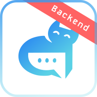

# Anomer backend

<p align="center">
  
</p>

<p align="center">Cute cat ^-^</p>


**A***nother* **N***ew* **O***nline* **ME***ssenge***R**

Зависимости:
- Python >= 3.12.3
- uv >= 0.8.4 (Homebrew)
- FastAPI >=0.115.14
- Uvicorn >= 2.0.41
- async SQLAlchemy >= 2.0.41
- Alembic >= 1.16.4

# Описание
```python
raise NotImplementedError
```

# Установка

## MacOS
### Подготовка к установке
>Примечание: команды ниже необходимо выполнять в терминале (bash или другая shell оболочка). Убедитесь, что у вас есть утилита `git` и она корректно настроена: см. [Установка Git](https://www.w3schools.com/git/git_install.asp?remote=github) и [Git&Github. Начало работы](https://www.w3schools.com/git/git_remote_getstarted.asp?remote=github)

>ВАЖНО: в проекте используется пакетный менеджер [`uv`](https://habr.com/ru/companies/otus/articles/903578/) вместо `pip`. Рекомендую установить его с помощью [`Homebrew`](https://brew.sh/):

Установите `Homebrew`:
  ```shell
  /bin/bash -c "$(curl -fsSL https://raw.githubusercontent.com/Homebrew/install/HEAD/install.sh)"
  ```
Затем установите `uv`:
  ```shell
  brew install uv
  ```

### Автоматическая установка

1. Клонируйте репозиторий и перейдите в корневую директорию проекта:
```shell
git clone https://github.com/raphaelgolubev/anomer_backend.git && cd anomer_backend
```

2. Запустите автоматический скрипт установки:
```shell
chmod +x install.sh && ./install.sh
```

Скрипт автоматически:
- ✅ Проверит наличие необходимых утилит
- ✅ Создаст директорию `certs` и сгенерирует RSA ключи
- ✅ Установит зависимости проекта
- ✅ Покажет инструкции по настройке `.env` файла

### Ручная установка (альтернатива)

Если вы предпочитаете ручную установку:

1. Создайте папку для хранения сертификатов `certs`:
```shell
mkdir certs
```

2. Сгенерируйте приватный ключ (RSA):
```shell
openssl genrsa -out certs/jwt-private.pem 2048
```

3. Получите публичный ключ:
```shell
openssl rsa -in certs/jwt-private.pem -outform PEM -pubout -out certs/jwt-public.pem
```

4. Установите [`Docker Desktop`](https://docs.docker.com/desktop/setup/install/mac-install/) и запустите его.

5. Инициализируйте проект:
```shell
uv sync
```

### Настройка окружения

Скопируйте файл `.env.example` в `.env`:
```shell
cp .env.example .env
```

Отредактируйте файл `.env` и замените значения на ваши:
```shell
nano .env
# или
code .env
# или любой другой текстовый редактор
```

**Важно:** Для работы с Redis аутентификацией убедитесь, что в `.env` файле указаны:
- `REDIS_USERNAME=default` (или ваш username)
- `REDIS_PASSWORD=your_redis_password`

### Запуск

1. Запустите базы данных:
```shell
docker-compose up pg redis -d --build
```
Эта команда скачает образы `PostgreSQL` и `Redis` и запустит контейнеры в фоновом режиме.

**Примечание:** Если вы настроили Redis с аутентификацией, убедитесь что Redis запущен с правильными настройками:
```shell
# Проверка подключения к Redis
redis-cli -a your_redis_password ping
```

2. Выполните миграцию:
```shell
chmod +x alembic.sh && ./alembic.sh upgrade head
```

3. Запустите сервер:
```shell
uv run main.py
```
Эта команда запустит локальный сервер по адресу http://0.0.0.0:8001

>ПРИМЕЧАНИЕ: Убедитесь, что в файле `.env` правильно настроены все переменные окружения, особенно настройки базы данных, Redis и почты.

## Linux
```python
raise NotImplementedError
```

## Windows
```python
raise NotImplementedError
```

# Отладка
В `Visual Studio Code` (или его форках, например `Cursor`) IDE добавьте следующую конфигурацию в `launch.json`:
```json
{
    "name": "Debugger: FastAPI app",
    "type": "debugpy",
    "request": "launch",
    "module": "uvicorn",
    "args": [
        "src.app:app",
        "--host",
        "0.0.0.0",
        "--port",
        "8001"
    ],
    "jinja": false,
    "envFile": "${workspaceFolder}/.env"
}
```
Если Вы хотите добавить конфигурацию только для этого проекта, тогда создайте директорию `.vscode` в корневой папке:
```shell
mkdir .vscode
```
Создайте файл launch.json:
```shell
touch launch.json
```
И поместите в этот файл следующее содержимое:
```json
{
    "version": "0.2.0",
    "configurations": [
        {
            "name": "Debugger: FastAPI app",
            "type": "debugpy",
            "request": "launch",
            "module": "uvicorn",
            "args": [
                "src.app:app",
                "--host",
                "0.0.0.0",
                "--port",
                "8001"
            ],
            "jinja": false,
            "envFile": "${workspaceFolder}/.env"
        }
    ]
}
```

<!--описание коммитов-->
# Описание коммитов
| Название | Описание                                                        |
|----------|-----------------------------------------------------------------|
| build	   | Сборка проекта или изменения внешних зависимостей               |
| sec      | Безопасность, уязвимости                                        |
| ci       | Настройка CI и работа со скриптами                              |
| docs	   | Обновление документации                                         |
| feat	   | Добавление нового функционала                                   |
| fix	     | Исправление ошибок                                              |
| perf	   | Изменения направленные на улучшение производительности          |
| refactor | Правки кода без исправления ошибок или добавления новых функций |
| revert   | Откат на предыдущие коммиты                                     |
| style	   | Правки по кодстайлу (табы, отступы, точки, запятые и т.д.)      |
| test	   | Добавление тестов                                               |

# License

GNU AGPLv3