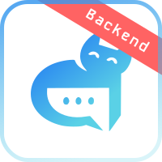

<p align="center">
  
  <h1 align="center">Anomer (backend)</h1>
  <p align="center"> Another New Online MEssengeR</p>
</p>

<p align="center">
  
  
  
  
  
  
</p>

# Описание
**Anomer** - это просто еще один мессенджер без нагружающих деталей и усложненного функционала.
Этот репозиторий представляет реализацию бэкенда для [iOS-клиента](https://github.com/raphaelgolubev/anomer_ios).

# Установка

Инструкции по установке вы можете найти [здесь (нажмите сюда)](docs/INSTALL.md)

# Отладка
В `Visual Studio Code` (или в однои из его форков, например `Cursor`) добавьте следующую конфигурацию в `launch.json`:
```json
{
    "name": "Debugger: FastAPI app",
    "type": "debugpy",
    "request": "launch",
    "module": "uvicorn",
    "args": [
        "src.app:app",
        "--host",
        "0.0.0.0",
        "--port",
        "8001"
    ],
    "jinja": false,
    "envFile": "${workspaceFolder}/.env"
}
```
Если Вы хотите добавить конфигурацию только для этого проекта, тогда создайте директорию `.vscode` в корневой папке:
```shell
mkdir .vscode
```
Создайте файл launch.json:
```shell
touch launch.json
```
И поместите в этот файл следующее содержимое:
```json
{
    "version": "0.2.0",
    "configurations": [
        {
            "name": "Debugger: FastAPI app",
            "type": "debugpy",
            "request": "launch",
            "module": "uvicorn",
            "args": [
                "src.app:app",
                "--host",
                "0.0.0.0",
                "--port",
                "8001"
            ],
            "jinja": false,
            "envFile": "${workspaceFolder}/.env"
        }
    ]
}
```

# Описание коммитов
| Название | Описание                                                        |
|----------|-----------------------------------------------------------------|
| build	   | Сборка проекта или изменения внешних зависимостей               |
| sec      | Безопасность, уязвимости                                        |
| ci       | Настройка CI и работа со скриптами                              |
| docs	   | Обновление документации                                         |
| feat	   | Добавление нового функционала                                   |
| fix	     | Исправление ошибок                                              |
| perf	   | Изменения направленные на улучшение производительности          |
| refactor | Правки кода без исправления ошибок или добавления новых функций |
| revert   | Откат на предыдущие коммиты                                     |
| style	   | Правки по кодстайлу (табы, отступы, точки, запятые и т.д.)      |
| test	   | Добавление тестов                                               |

# License

GNU AGPLv3