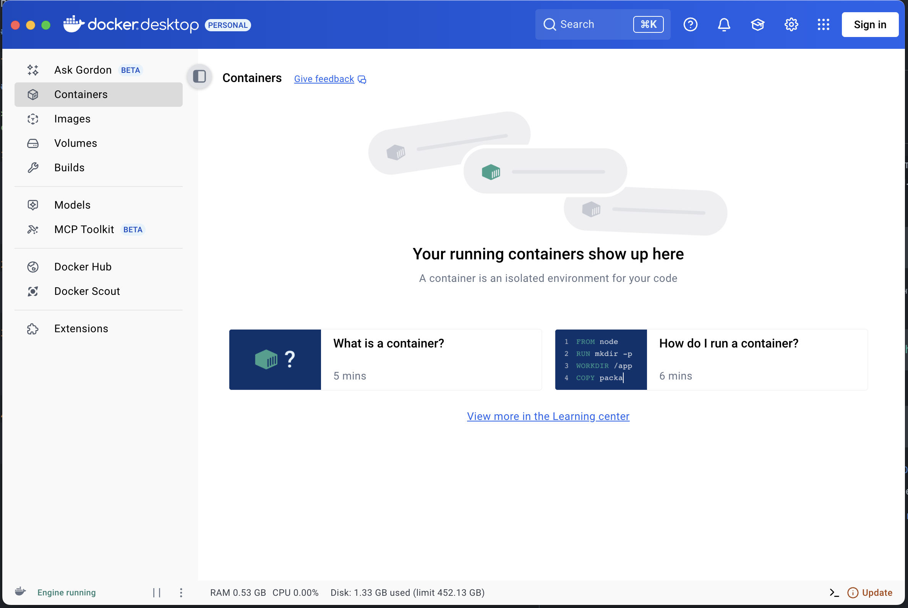

# Запуск

Перед запуском убедитесь, что вы [выполнили установку](INSTALL.md).

## Подготовка

- Запустите `Docker Desktop` и сверните его



## Запуск проекта

>ПРИМЕЧАНИЕ: Убедитесь, что в файле `.env` правильно настроены все переменные окружения, особенно настройки базы данных, Redis и почты.

1. Запустите базы данных:
    ```shell
    docker-compose up pg redis -d --build
    ```

    <sub> Эта команда скачает образы `PostgreSQL` и `Redis` и запустит контейнеры в фоновом режиме. </sub>

2. Выполните миграции:
    ```shell
    ./alembic.sh upgrade head
    ```

3. Запустите сервер:
    ```shell
    uv run main.py
    ```
    <sub> Эта команда запустит локальный сервер по адресу http://0.0.0.0:8001 </sub>

4. Перейдите по адресу http://0.0.0.0:8001 в вашем браузере.

 Если у вас возникли проблемы при запуске, тогда попробуйте [найти решение проблемы здесь](TROUBLESHOOTING.md#проблемы-при-запуске).