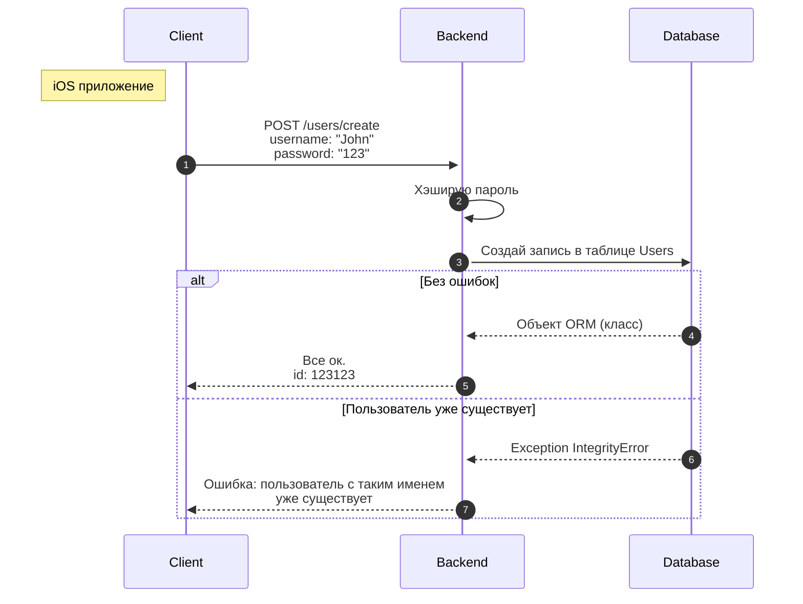

# Регистрация
## Создание пользователя в БД

```mermaid
sequenceDiagram

autonumber

participant C as Client
participant B as Backend
participant DB as Database

%% ->> - сплошная стрелка
%% -->> - пунктирная стрелка
%% ->>+ - знак плюса на конце это то же самое что activate
%% ->>- - знак минуса на конце это то же самое что deactivate
%% <<->> - сплошная двунаправленная стрелка
%% <<-->> - пунктирная двунаправленная стрелка
%% -x - сплошная линия с крестиком на конце
%% --x - пунктирная линия с крестиком на конце
%% -) - сплошная линия с открывающей стрелкой на конце (async операция)
%% --) - пунктирная линия с открывающей стрелкой на конце (async операция)

%% Note [ right of | left of | over ] [Actor]: Text in note content

Note left of C: iOS приложение

C ->>+ B: POST /users/create<br>username: "John"<br>password: "123"
B ->> B: Хэширую пароль
B ->> DB: Создай запись в таблице Users
alt Без ошибок
    DB -->> B: Объект ORM (класс)
    B -->> C: Все ок.<br>id: 123123
else Пользователь уже существует
    DB -->> B: Exception IntegrityError
    B -->> C: Ошибка: пользователь с таким именем<br>уже существует
end
```

## Верификация пользователя
